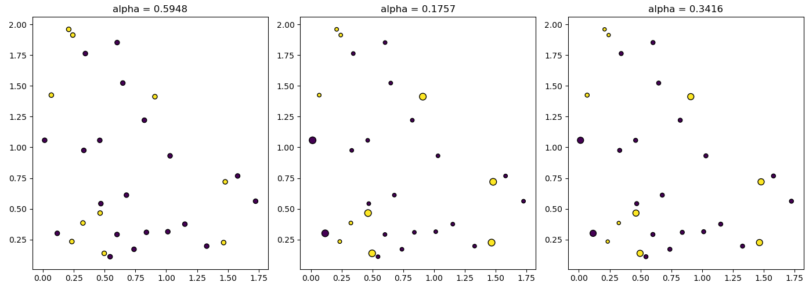

## Decision Tree & Random Forest Classifier and Regressor

### 1 Decision Tree Implementation

The decision tree implementation is in tree/base.py. 
The code is written in Python and not using existing libraries other than the ones already imported in the code. The decision tree works for four cases: i. discrete features, discrete output; ii. discrete features, real output; iii real features, discrete output; real features, real output. The decision tree can use GiniIndex or InformationGain as the criteria for splitting. The code is also able to plot/display the decision tree. 
> Information about files 
- `metrics.py` : This file contains the performance metrics functions.  

- `usage.py`: This file is used to pressure-test the code

- tree (Directory): Module for decision tree.
    - `base.py` : Complete Decision Tree Class.
    - `utils.py`: Complete all utility functions.
    - `__init__.py`: **Do not edit this**

> You should run _usage.py_ to pressure test the Decision tree. 

### 2 Cross Validation and Nested Cross Validation

Generating a random dataset using the following lines of code

```python
from sklearn.datasets import make_classification
X, y = make_classification(
n_features=2, n_redundant=0, n_informative=2,random_state=1, n_clusters_per_class=2, class_sep=0.5)

# For plotting
import matplotlib.pyplot as plt
plt.scatter(X[:, 0], X[:, 1], c=y)
```

`classification-exp.py` contains the code for the experiments.

#### 2a Pressure testing the Decision tree

Illustrating the usuage of *decision tree* on the above dataset. The first 70% of the data is used for training purposes and the remaining 30% for test purposes. The accuracy, per-class precision and recall of the decision tree on the test dataset is shown below. 

On running `classification-exp.py`, the result is printed, which is shown below. 
```
Training the model on 70% data and testing on remaining 30%.

The accuracy for test dataset is 93.33333333333333%.
Precision for 0 is : 0.9166666666666666
Recall for 0 is : 0.9166666666666666
Precision for 1 is : 0.9444444444444444
Recall for 1 is : 0.9444444444444444
```

#### 2b Cross Validation & Nested Cross Validation

Cross Validation and using nested cross-validation find the optimum depth of the tree.

```
Experiments for 5-Fold cross-validation.

For FOLD 5
With tree depth = 2
The accuracy for test dataset is 95.0%.
Precision for 1 is : 0.9230769230769231
Recall for 1 is : 1.0
Precision for 0 is : 1.0
Recall for 0 is : 0.875

Experiments to find optimum depth of the tree using 5-Fold Nested Cross-Validation.

First 80 smaples are used for training and validation. The last 20 samples are used for testing.

For FOLD 5
The size of training data :  (64, 2) 64
The size of validation data :  (16, 2) 16
With tree depth = 1
The accuracy for validation dataset is 87.5%.
With tree depth = 2
The accuracy for validation dataset is 87.5%.
With tree depth = 3
The accuracy for validation dataset is 81.25%.
With tree depth = 4
The accuracy for validation dataset is 81.25%.
With tree depth = 5
The accuracy for validation dataset is 81.25%.
With tree depth = 6
The accuracy for validation dataset is 81.25%.
```

The best model (having highest validation accuracy) has minimum depth of 1.
The highest validation accuracy is found as 93.75%.
The best model found out has a test accuracy of 95.0%.


### 3 Automotive efficiency 

<p><a href="https://archive.ics.uci.edu/ml/datasets/auto+mpg">  Automotive efficiency</a> problem is solved using scikit learn decison tree and the decision tree developed in Section-1. 

On running `auto-efficiency.py`, the result is printed, which is shown below. 

```
The columns in dataframe are  :  ['mpg', 'cylinders', 'displacement', 'horsepower', 'weight', 
'acceleration', 'model_year', 'origin', 'car_name']
The shape of X :  (392, 8) . The size of y is :  392
The datatypes of columns after coversion are
 mpg             float64
cylinders         int64
displacement    float64
horsepower      float64
weight          float64
acceleration    float64
model_year        int64
origin            int64
car_name         object
dtype: object
```

#### 3a Usuage of decision tree for automotive efficiency problem.

Since the input data is mix of real and discrete data, two type of decision trees 
were learned (1) For real input and (2) For discrete output. Final output (i.e. mpg) 
can be obtained as combination from both the trees.

```
The training error for Real Input Real Output (RIRO) type decision tree having max-depth 6 is :
RMSE:  15.032645618033587
MAE:  14.049795918367348

The training error for Discrete Input Real Output (DIRO) type decision tree having max-depth 6 is : 
RMSE:  3.341710728676004
MAE:  2.5444350139395904
```

#### 3b Comparison with scikit learn
```
The training error for Scikit-learn's decision (regression) tree having max-depth 6 is :
RMSE:  1.8372633689388513
MAE:  1.3030166788995607

The performance by combining both the decision trees (Real input and discrete input) having 
depth 6 learn in part-(a) is shown below :
RMSE:  4.297558242303572
MAE:  3.4082256064381227
```
### 4 Experimenting with Runtime Complexity of Decision Tree

We created some fake data to do some experiments on the runtime complexity of the decision tree algorithm.Random dataset with N samples and M binary features were created. 

> `experiments.py`  contains the code for experiments. 

The runtime complexity for 4 cases of decision tree is summarized below : 

| Decision Tree Type                    | Training Time  | Prediction Time|
|---------------------------------------|----------------|----------------|
| Real Input Real Output         (RIRO) | $O(dMNlogN)$   | $O(Nd)$        |  
| Real Input Discrete Output     (RIDO) | $O(dMNlongN)$  | $O(Nd)$        |
| Discrete Input Real Output     (DIRO) | $O(Md)$        | $O(Nd)$        |
| Discrete Input Discrete Output (DIDO) | $O(Md)$        | $O(Nd)$        |

Details about the experimentation and derivation of runtime complexities is provided in `Runtime_decision_tree.md` file. 


### 5 AdaBoostClassifier

sklearn decision tree is used to implement AdaBoostClassifier. AdaBoostClassifier is used to solve for Real Input Discrete Output and for Classification Problem.

#### 5-a Real Input Discrete output

A random real input with 2 features and discrete output with 2 classes was generated.
The plot scatter plot of 3 estimators used in AdaBoostClassifier with their respective $\alpha$  are shown. The size of the marker is proportional to the weight of the point. The color of the point represents the actual class present in training data.
<p align="center">
    
</p>

The combined decision surface is shown below : 

<p align="center">
    
</p>

#### 5-b Classification Dataset

<p align="center">
    
</p>

3 Decision stump (depth-1 tree) were used in AdaBoost. The plot of estimators with their alph's is and the plot of combined decision surface is shown below : 

<p align="center">
    
</p>

<p align="center">
    
</p>

### 6 Bagging

Bagging was implemented using scikit learn Decision Tree. Bagging was tested for the case of Real Input Discrete Output. A random real input with 2 features and discrete output with 2 classes was generated. 

`ensemble/bagging.py` contains the implementation of Bagging and `q6_Bagging.py` contains the code for testing.

The maximum depth of tree was set to be 3. The number of rounds in Bagging was also set as 3. 

The decision surface for each round and the combined decision surface is shown.

<p align="center">
    
</p>

<p align="center">
    
</p>

### 7 Random Forest

Implemented RandomForestClassifier() and RandomForestRegressor() classes in `tree/randomForest.py`. `q7_RandomForest.py` is for testing.
Random forest is implemented in such way that a user can select whether to use scikit learn decision tree or the Decision tree implemented in section-1. A random set of features are selected to train the decision trees. The max-depth of tree and number of trees in forest can be given by user. The classification dataset is shown below : 

<p align="center">
    
</p>

A random seed of 43 was fixed and dataset was shuffled according to seed. The first 60% of the data for training and last 40% of the data set for testing. Since the classification data has only two features both the features were used in the trees of random forest. 

A Random forest with 6 trees each having max-depth of 3 was learned for classification data. 
The figure of learned trees is shown below.

<p align="center">
    
</p>

The plot of decision surface for individual trees and combined decision surface is shown below : 

<p align="center">
    
</p>
<p align="center">
    
</p>