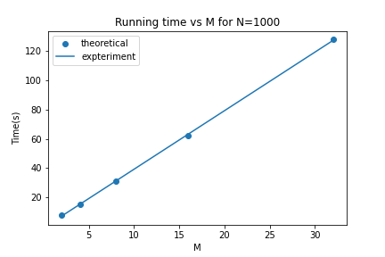
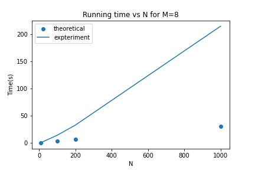
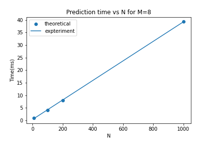
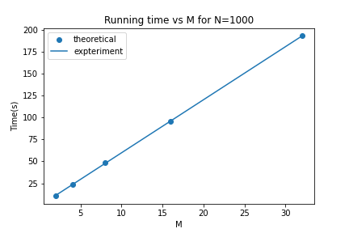
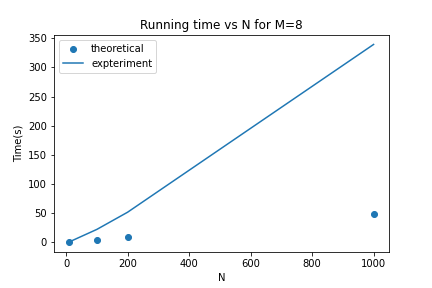
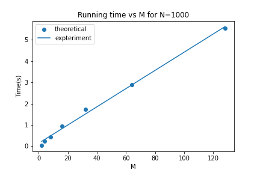
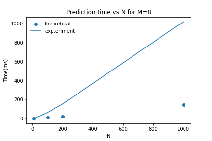
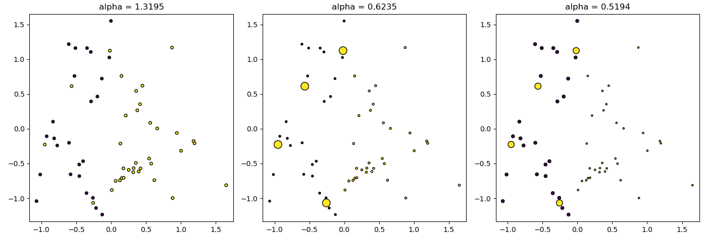

### Questions

1. The decision tree implementation is in tree/base.py. 
The code is written in Python and not using existing libraries other than the ones already imported in the code. The decision tree works for four cases: i) discrete features, discrete output; ii) discrete features, real output; iii) real features, discrete output; real features, real output. The decision tree can use GiniIndex or InformationGain as the criteria for splitting. The code is also able to plot/display the decision tree. 

    > Imformation about files
  
    - `metrics.py`: This file contains the performance metrics functions. 

    - `usage.py`: This file is used to pressure-test the code

    - tree (Directory): Module for decision tree.
      - `base.py` : Complete Decision Tree Class.
      - `utils.py`: Complete all utility functions.
      - `__init__.py`: **Do not edit this**

    > You should run _usage.py_ to pressure test the Decision tree. 

2. 
    Generating a random dataset using the following lines of code

    ```python
    from sklearn.datasets import make_classification
    X, y = make_classification(
    n_features=2, n_redundant=0, n_informative=2, random_state=1, n_clusters_per_class=2, class_sep=0.5)

    # For plotting
    import matplotlib.pyplot as plt
    plt.scatter(X[:, 0], X[:, 1], c=y)
    ```

    a) Showing the usage of *your decision tree* on the above dataset. The first 70% of the data should be used for training purposes and the remaining 30% for test purposes. Show the accuracy, per-class precision and recall of the decision tree you implemented on the test dataset. 

    b) Use 5 fold cross-validation on the dataset. Using nested cross-validation find the optimum depth of the tree.
    
    > You should be editing `classification-exp.py` for the code containing the experiments.

### Cross Validation and Nested Cross Validation

On running `classification-exp.py`, the result is printed, which is shown below. 
```
Q2-part(a) 

Training the model on 70% data and testing on remaining 30%.

The accuracy for test dataset is 93.33333333333333%.
Precision for 0 is : 0.9166666666666666
Recall for 0 is : 0.9166666666666666
Precision for 1 is : 0.9444444444444444
Recall for 1 is : 0.9444444444444444

Q2-part(b)

Experiments for 5-Fold cross-validation.


For FOLD 1
With tree depth = 2
The accuracy for test dataset is 90.0%.
Precision for 1 is : 1.0
Recall for 1 is : 0.8
Precision for 0 is : 0.8333333333333334
Recall for 0 is : 1.0

For FOLD 2
With tree depth = 2
The accuracy for test dataset is 95.0%.
Precision for 0 is : 1.0
Recall for 0 is : 0.9333333333333333
Precision for 1 is : 0.8333333333333334
Recall for 1 is : 1.0

For FOLD 3
With tree depth = 2
The accuracy for test dataset is 90.0%.
Precision for 1 is : 1.0
Recall for 1 is : 0.8181818181818182
Precision for 0 is : 0.8181818181818182
Recall for 0 is : 1.0

For FOLD 4
With tree depth = 2
The accuracy for test dataset is 85.0%.
Precision for 1 is : 1.0
Recall for 1 is : 0.75
Precision for 0 is : 0.7272727272727273
Recall for 0 is : 1.0

For FOLD 5
With tree depth = 2
The accuracy for test dataset is 95.0%.
Precision for 1 is : 0.9230769230769231
Recall for 1 is : 1.0
Precision for 0 is : 1.0
Recall for 0 is : 0.875

Experiments to find optimum depth of the tree using 5-Fold Nested Cross-Validation.

First 80 smaples are used for training and validation. The last 20 samples are used for testing.

For FOLD 1
The size of training data :  (64, 2) 64
The size of validation data :  (16, 2) 16
With tree depth = 1
The accuracy for validation dataset is 93.75%.
With tree depth = 2
The accuracy for validation dataset is 93.75%.
With tree depth = 3
The accuracy for validation dataset is 81.25%.
With tree depth = 4
The accuracy for validation dataset is 87.5%.
With tree depth = 5
The accuracy for validation dataset is 81.25%.
With tree depth = 6
The accuracy for validation dataset is 81.25%.

For FOLD 2
The size of training data :  (64, 2) 64
The size of validation data :  (16, 2) 16
With tree depth = 1
The accuracy for validation dataset is 75.0%.
With tree depth = 2
The accuracy for validation dataset is 81.25%.
With tree depth = 3
The accuracy for validation dataset is 81.25%.
With tree depth = 4
The accuracy for validation dataset is 81.25%.
With tree depth = 5
The accuracy for validation dataset is 81.25%.
With tree depth = 6
The accuracy for validation dataset is 81.25%.

For FOLD 3
The size of training data :  (64, 2) 64
The size of validation data :  (16, 2) 16
With tree depth = 1
The accuracy for validation dataset is 93.75%.
With tree depth = 2
The accuracy for validation dataset is 93.75%.
With tree depth = 3
The accuracy for validation dataset is 93.75%.
With tree depth = 4
The accuracy for validation dataset is 93.75%.
With tree depth = 5
The accuracy for validation dataset is 93.75%.
With tree depth = 6
The accuracy for validation dataset is 93.75%.

For FOLD 4
The size of training data :  (64, 2) 64
The size of validation data :  (16, 2) 16
With tree depth = 1
The accuracy for validation dataset is 75.0%.
With tree depth = 2
The accuracy for validation dataset is 75.0%.
With tree depth = 3
The accuracy for validation dataset is 81.25%.
With tree depth = 4
The accuracy for validation dataset is 87.5%.
With tree depth = 5
The accuracy for validation dataset is 81.25%.
With tree depth = 6
The accuracy for validation dataset is 75.0%.

For FOLD 5
The size of training data :  (64, 2) 64
The size of validation data :  (16, 2) 16
With tree depth = 1
The accuracy for validation dataset is 87.5%.
With tree depth = 2
The accuracy for validation dataset is 87.5%.
With tree depth = 3
The accuracy for validation dataset is 81.25%.
With tree depth = 4
The accuracy for validation dataset is 81.25%.
With tree depth = 5
The accuracy for validation dataset is 81.25%.
With tree depth = 6
The accuracy for validation dataset is 81.25%.


The best model (having highest validation accuracy) has minimum depth of 1.
The highest validation accuracy is found as 93.75%.
The best model found out has a test accuracy of 95.0%.
```

3. 
    a) Showing the usage of your decision tree for the [automotive efficiency](https://archive.ics.uci.edu/ml/datasets/auto+mpg) problem. 
    
    b) Compareing the performance of your model with the decision tree module from scikit learn. 
    
   >  `auto-efficiency.py` contains the code for experiments.

### Automotive efficiency 

<p><a href="https://archive.ics.uci.edu/ml/datasets/auto+mpg">  Automotive efficiency</a> problem is solved using scikit learn decison tree and the decision tree developed in Q1. 

On running `auto-efficiency.py`, the result is printed, which is shown below. 

```
The columns in dataframe are  :  ['mpg', 'cylinders', 'displacement', 'horsepower', 'weight', 
'acceleration', 'model_year', 'origin', 'car_name']
The shape of X :  (392, 8) . The size of y is :  392
The datatypes of columns after coversion are
 mpg             float64
cylinders         int64
displacement    float64
horsepower      float64
weight          float64
acceleration    float64
model_year        int64
origin            int64
car_name         object
dtype: object
Q3-(a) Usuage of decision tree for automotive efficiency problem.
Since the input data is mix of real and discrete data, Two type of decision trees 
were learned (1) For real input and (2) For discrete output. Final output (i.e. mpg) 
can be obtained as combination from both the trees.

The training error for Real Input Real Output (RIRO) type decision tree having max-depth 6 is :
RMSE:  15.032645618033587
MAE:  14.049795918367348

The training error for Discrete Input Real Output (DIRO) type decision tree having max-depth 6 is : 
RMSE:  3.341710728676004
MAE:  2.5444350139395904

Q3-(b) Comparison with scikit learn

The training error for Scikit-learn's decision (regression) tree having max-depth 6 is :
RMSE:  1.8372633689388513
MAE:  1.3030166788995607

The performance by combining both the decision trees (Real input and discrete input) having 
depth 6 learn in part-(a) is shown below :
RMSE:  4.297558242303572
MAE:  3.4082256064381227
```
    
4. Create some fake data to do some experiments on the runtime complexity of your decision tree algorithm. Create a dataset with N samples and M binary features. Vary M and N to plot the time taken for: 1) learning the tree, 2) predicting for test data. How do these results compare with theoretical time complexity for decision tree creation and prediction. You should do the comparison for all the four cases of decision trees. 

    >`experiments.py`  contains the code for experiments. 

#### Real Input Real Output

Since, the input is real we do not have binary features for this case. The running time analysis for learning and predicting is shown as follow.

<ol>
<li>Learning the tree</li>
A brief pseudo-code working of the Decision Tree algorithm for this case is shown below:

```
for column in X.columns: O(M)
    sort based on that column. Assuming quick or merge sort with O(NlogN).
    
    for all possible splits: O(N)
        compute loss O(1) (Assuming loss computation is vectorized, and occurs fast)

    Add that node + some constant operations. O(1)

Recursively split left and right
```
The recurrance relation for worst case runtime complexity can be written as 
T(N,M)=O(MNlogN)+T(N-1,M)+O(1)
Assume the depth of tree is d. Therefore the recurrance can do upto d.
T(N,M)=O(dMNlogN)

The wall clock time for training the tree for different values of N and M is computed using code in `experiments.py`. The values of running time are tabulated below.

<table>
<tr>
<th>M</th><th>2</th><th>4</th><th>8</th><th>16</th><th>32</th>
</tr>
<tr>
<td>N=10</td><td>0.0669</td><td>0.0994</td><td>0.1980</td><td>0.3442</td><td>0.7814</td>
</tr>
<tr>
<td>N=100</td><td>0.7632</td><td>1.5220</td><td>3.0516</td><td>6.2441</td><td>12.2942</td>
</tr>
<tr>
<td>N=200</td><td>1.7414</td><td>3.2383</td><td>6.3664</td><td>12.5297</td><td>24.4854</td>
</tr>
<tr>
<td>N=1000</td><td>7.7783</td><td>15.5268</td><td>31.1077</td><td>62.0365</td><td>127.6367</td>
</tr>
</table>

The plot for the running time by varying N and M from experiments and fitted with theoretical relation are shown.

<p align="center">
    
    
</p>


<li>Predicting for test data</li>
A brief pseudo-code working of the Decision Tree algorithm for predicting on N input samples is shown below:

```
for test input: O(N)
    for every sample we need to traverse upto the leaf. O(d)
```
The worst case time complexity for prediciton is : O(Nd)

The plot for the running time by varying N from experiments and theoretical relation are shown.
<p align="center">
    
</p>

</ol>

#### Real Input Discrete Output

Since, the input is real we do not have binary features for this case. The output is discrete and it is assumed that output consists of 2 classes i.e. a binary output. The running time analysis for learning and predicting is shown as follow.

<ol>
<li>Learning the tree</li>
A brief pseudo-code working of the Decision Tree algorithm for this case is shown below:

```
for column in X.columns: O(M)
    sort based on that column. Assuming quick or merge sort with O(NlogN).
    
    for all possible splits on y: O(N)
        compute loss O(1) (Assuming loss computation is vectorized, and occurs fast)

    Add that node + some constant operations. O(1)

Recursively split left and right
```
The recurrance relation for worst case runtime complexity can be written as 
T(N,M)=O(MNlogN)+T(N-1,M)+O(1)
Assume the depth of tree is d. Therefore the recurrance can do upto d.
T(N,M)=O(dMNlogN)

The plot for the running time from experiments and fit with theoretical relation by varying N and M are shown.
<p align="center">
    
    
</p>

<li>Predicting for test data</li>
The analysis for this case is similar to that for prediction in case of Real Input Real Output. 

The worst case time complexity for prediciton on input of $N$ samples is : O(Nd) 
The plot for the running time by varying N from experiments and fit with theoretical relation are shown.
<p align="center">
    
</p>

#### Discrete Input Real Output
The input with N samples and M binary features was experimented. 

<ol>
<li>Learning the tree</li>
A brief pseudo-code working of the Decision Tree algorithm for this case is shown below:

```
for every attribute: O(M)
    for all unique values:O(1) (binary attribute)
        compute loss/gain. Assuming O(1)

Recurse this function for all unique values of that attribute.
```
T(N,M)=O(M)+T(N-1,M)+...(upto d times)=O(Md)

The plot for the running time from experiments and fit with theoretical relation by varying M is shown.
<p align="center">
    
</p>

<li>Predicting for test data</li>
The analysis for this case is similar to that for prediction in case of Real Input Real Output. 

The worst case time complexity for prediciton on input of $N$ samples is : O(Nd)
The plot for the running time by varying N from experiments and theoretical relation are shown. It should be noted that even for large values of N, time taken to make prediction is very less. This is also evident from the plot shown below. Moreover, the theretical analysis is a worst case analysis, and not always that worst case is encountered.
<p align="center">
    
</p>

#### Discrete Input Discrete Output

The input with N samples and M binary features was experimented. The output is assumed to be a binary output.  
<ol>
<li>Learning the tree</li>
A brief pseudo-code working of the Decision Tree algorithm for this case is shown below:

```
for every attribute: O(M)
    for all unique values:O(1) (binary attribute)
        compute loss/gain. Assuming O(1)

Recurse this function for all unique values of that attribute.
```
T(N,M)=O(M)+T(N-1,M)+...(upto d times) = O(Md)

The plot for the running time from experiments and theoretical relation by varying M is shown.
<p align="center">
    
</p>

<li>Predicting for test data</li>
The analysis for this case is similar to that for prediction in case of Real Input Real Output. 

The worst case time complexity for prediciton on input of N samples is : O(Nd)
The plot for the running time by varying N from experiments and fit with theoretical relation are shown. 
<p align="center">
    
</p>

5. 
    a) Implementing Adaboost on Decision Stump (depth -1 tree). The previously coded Decision Tree learnt or sklearn decision tree can be used to solve for the case of real input and discrete output. Code file `ensemble/ADABoost.py` 

    b) Implement AdaBoostClassifier on classification data set. Fix a random seed of 42. Shuffle the dataset according to this random seed. Use the first 60% of the data for training and last 40% of the data set for testing. Plot the decision surfaces as done  and compare the accuracy of AdaBoostClassifier using 3 estimators over decision stump. code file `q5_ADABoost.py`. 

### AdaBoostClassifier

sklearn decision tree is used to implement AdaBoostClassifier. The figures of part-a and part-b are shown below :

#### 5-a Real Input Discrete output

A random real input with 2 features and discrete output with 2 classes was generated.
The plot scatter plot of 3 estimators used in AdaBoostClassifier with their respective alpha's are shown. The size of the marker is proportional to the weight of the point. The color of the point represents the actual class present in training data.
<p align="center">
    
</p>

The combined decision surface is shown below : 

<p align="center">
    
</p>

#### 5-b Classification Dataset

<p align="center">
    
</p>

3 Decision stump (depth-1 tree) were used in AdaBoost. The plot of estimators with their alph's is and the plot of combined decision surface is shown below : 

<p align="center">
    
</p>

<p align="center">
    
</p>

6.
    a) Implement Bagging(BaseModel, num_estimators): where base model is be DecisionTree (or sklearn decision tree) you have implemented. Code file `ensemble/bagging.py`.  `q6_Bagging.py` is for testing.[*Bagginh implemented only for DecisionTrees ]

### Bagging

Bagging was implemented using scikit learn Decision Tree. Bagging was tested for the case of  Real Input Discrete Output. A random real input with 2 features and discrete output with 2 classes was generated. 

The maximum depth of tree was set to be 3. The number of rounds in Bagging was also set as 3. 

The decision surface for each round and the combined decision surface is shown.

<p align="center">
    
</p>

<p align="center">
    
</p>
    
7. 
    a) Implementing RandomForestClassifier() and RandomForestRegressor() classes in `tree/randomForest.py`. `q7_RandomForest.py` is for testing.

     b) Generating the plots for classification data set. Fix a random seed of 42. Shuffle the dataset according to this random seed. Use the first 60% of the data for training and last 40% of the data set for testing. Include you code in `random_forest_classification.py`

### Random Forest

The classification problem is solved in Q7-b using random forest. Random forest in such way that a user can select whether to use scikit learn decision tree or the Decision tree implemented in Q1. A random set of features are selected to train the decision trees. The max-depth of tree and number of trees in forest can be given by user. The classification dataset is shown below : 

<p align="center">
    
</p>

A random seed of 43 was fixed and dataset was shuffled according to seed. The first 60% of the data for training and last 40% of the data set for testing. Since the classification data has only two features both the features were used in the trees of random forest. 

A Random forest with 6 trees each having max-depth of 3 was learned for classification data. 

The figure of learned trees is shown below.

<p align="center">
    
</p>

The plot of decision surface for individual trees and combined decision surface is shown below : 

<p align="center">
    
</p>

<p align="center">
    
</p>