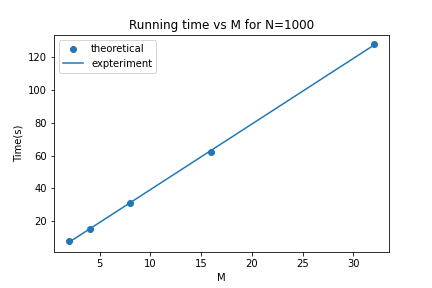
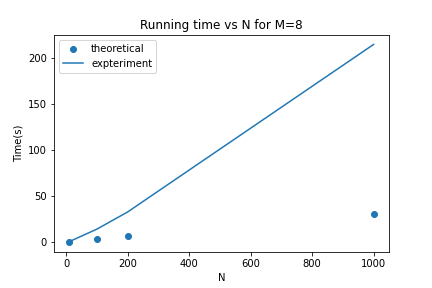
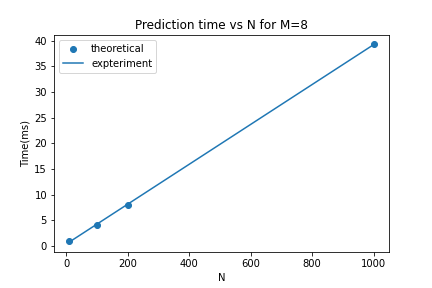
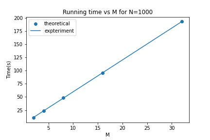
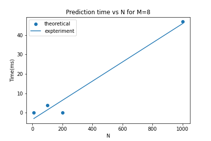
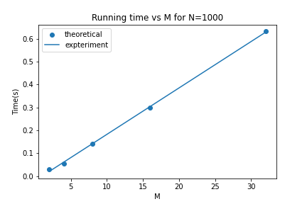
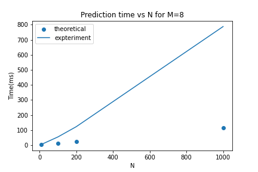
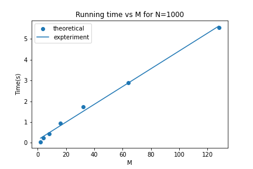
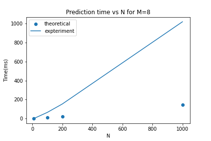

### 4 Experimenting with Runtime Complexity of Decision Tree

We created some fake data to do some experiments on the runtime complexity of the decision tree algorithm.Random dataset with N samples and M binary features were created. Vary M and N to plot the time taken for: 1) learning the tree, 2) predicting for test data.

    >`experiments.py`  contains the code for experiments. 

#### Real Input Real Output

Since, the input is real we do not have binary features for this case. The running time analysis for learning and predicting is shown as follow.

<ol>
<li>Learning the tree</li>
A brief pseudo-code working of the Decision Tree algorithm for this case is shown below:

```
for column in X.columns: O(M)
    sort based on that column. Assuming quick or merge sort with O(NlogN).
    
    for all possible splits: O(N)
        compute loss O(1) (Assuming loss computation is vectorized, and occurs fast)

    Add that node + some constant operations. O(1)

Recursively split left and right
```
The recurrance relation for worst case runtime complexity can be written as 
T(N,M)=O(MNlogN)+T(N-1,M)+O(1)
Assume the depth of tree is d. Therefore the recurrance can do upto d.
T(N,M)=O(dMNlogN)

The wall clock time for training the tree for different values of N and M is computed using code in `experiments.py`. The values of running time are tabulated below.

<table>
<tr>
<th>M</th><th>2</th><th>4</th><th>8</th><th>16</th><th>32</th>
</tr>
<tr>
<td>N=10</td><td>0.0669</td><td>0.0994</td><td>0.1980</td><td>0.3442</td><td>0.7814</td>
</tr>
<tr>
<td>N=100</td><td>0.7632</td><td>1.5220</td><td>3.0516</td><td>6.2441</td><td>12.2942</td>
</tr>
<tr>
<td>N=200</td><td>1.7414</td><td>3.2383</td><td>6.3664</td><td>12.5297</td><td>24.4854</td>
</tr>
<tr>
<td>N=1000</td><td>7.7783</td><td>15.5268</td><td>31.1077</td><td>62.0365</td><td>127.6367</td>
</tr>
</table>

The plot for the running time by varying N and M from experiments and fitted with theoretical relation are shown.

<p align="center">
    
    
</p>


<li>Predicting for test data</li>
A brief pseudo-code working of the Decision Tree algorithm for predicting on N input samples is shown below:

```
for test input: O(N)
    for every sample we need to traverse upto the leaf. O(d)
```
The worst case time complexity for prediciton is : O(Nd)

The plot for the running time by varying N from experiments and theoretical relation are shown.
<p align="center">
    
</p>

</ol>

#### Real Input Discrete Output

Since, the input is real we do not have binary features for this case. The output is discrete and it is assumed that output consists of 2 classes i.e. a binary output. The running time analysis for learning and predicting is shown as follow.

<ol>
<li>Learning the tree</li>
A brief pseudo-code working of the Decision Tree algorithm for this case is shown below:

```
for column in X.columns: O(M)
    sort based on that column. Assuming quick or merge sort with O(NlogN).
    
    for all possible splits on y: O(N)
        compute loss O(1) (Assuming loss computation is vectorized, and occurs fast)

    Add that node + some constant operations. O(1)

Recursively split left and right
```
The recurrance relation for worst case runtime complexity can be written as 
T(N,M)=O(MNlogN)+T(N-1,M)+O(1)
Assume the depth of tree is d. Therefore the recurrance can do upto d.
T(N,M)=O(dMNlogN)

The plot for the running time from experiments and fit with theoretical relation by varying N and M are shown.
<p align="center">
    
    
</p>

<li>Predicting for test data</li>
The analysis for this case is similar to that for prediction in case of Real Input Real Output. 

The worst case time complexity for prediciton on input of $N$ samples is : O(Nd) 
The plot for the running time by varying N from experiments and fit with theoretical relation are shown.
<p align="center">
    
</p>

#### Discrete Input Real Output
The input with N samples and M binary features was experimented. 

<ol>
<li>Learning the tree</li>
A brief pseudo-code working of the Decision Tree algorithm for this case is shown below:

```
for every attribute: O(M)
    for all unique values:O(1) (binary attribute)
        compute loss/gain. Assuming O(1)

Recurse this function for all unique values of that attribute.
```
T(N,M)=O(M)+T(N-1,M)+...(upto d times)=O(Md)

The plot for the running time from experiments and fit with theoretical relation by varying M is shown.
<p align="center">
    
</p>

<li>Predicting for test data</li>
The analysis for this case is similar to that for prediction in case of Real Input Real Output. 

The worst case time complexity for prediciton on input of $N$ samples is : O(Nd)
The plot for the running time by varying N from experiments and theoretical relation are shown. It should be noted that even for large values of N, time taken to make prediction is very less. This is also evident from the plot shown below. Moreover, the theretical analysis is a worst case analysis, and not always that worst case is encountered.
<p align="center">
    
</p>

#### Discrete Input Discrete Output

The input with N samples and M binary features was experimented. The output is assumed to be a binary output.  
<ol>
<li>Learning the tree</li>
A brief pseudo-code working of the Decision Tree algorithm for this case is shown below:

```
for every attribute: O(M)
    for all unique values:O(1) (binary attribute)
        compute loss/gain. Assuming O(1)

Recurse this function for all unique values of that attribute.
```
T(N,M)=O(M)+T(N-1,M)+...(upto d times) = O(Md)

The plot for the running time from experiments and theoretical relation by varying M is shown.
<p align="center">
    
</p>

<li>Predicting for test data</li>
The analysis for this case is similar to that for prediction in case of Real Input Real Output. 

The worst case time complexity for prediciton on input of N samples is : O(Nd)
The plot for the running time by varying N from experiments and fit with theoretical relation are shown. 
<p align="center">
    
</p>
