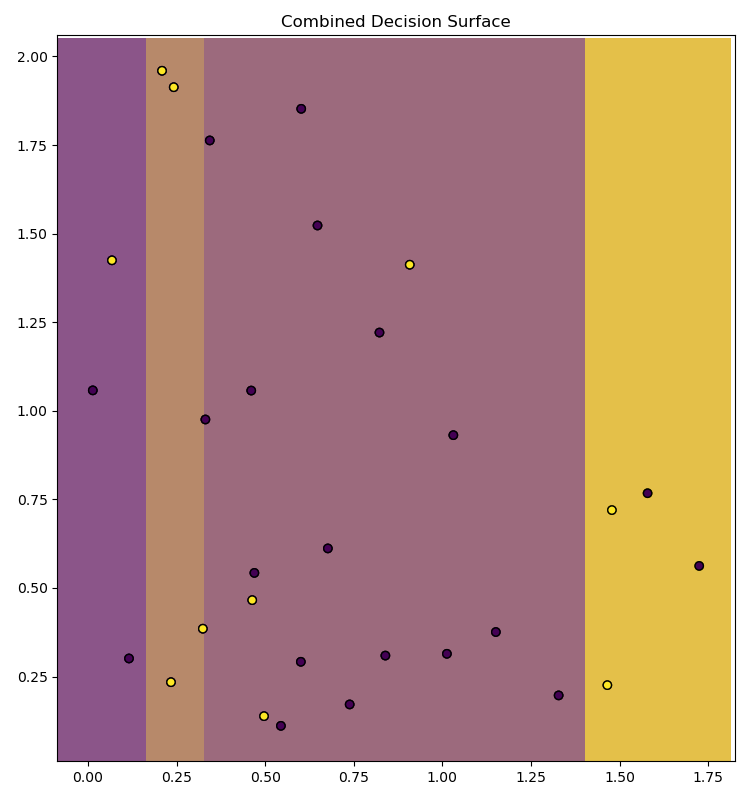
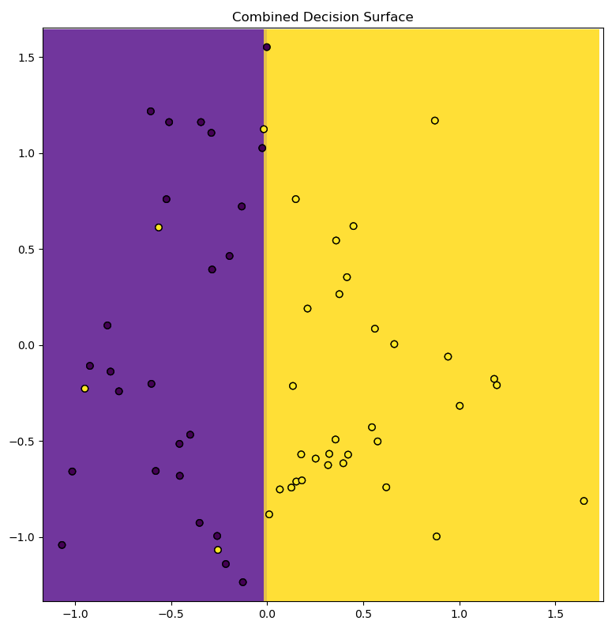

### AdaBoostClassifier

sklearn decision tree is used to implement AdaBoostClassifier. The figures of part-a and part-b are shown below :

#### 5-a Real Input Discrete output

A random real input with 2 features and discrete output with 2 classes was generated.
The plot scatter plot of 3 estimators used in AdaBoostClassifier with their respective alpha's are shown. The size of the marker is proportional to the weight of the point. The color of the point represents the actual class present in training data.

    

The combined decision surface is shown below : 

    

#### 5-b Classification Dataset

    

3 Decision stump (depth-1 tree) were used in AdaBoost. The plot of estimators with their alph's is and the plot of combined decision surface is shown below : 

    

    

