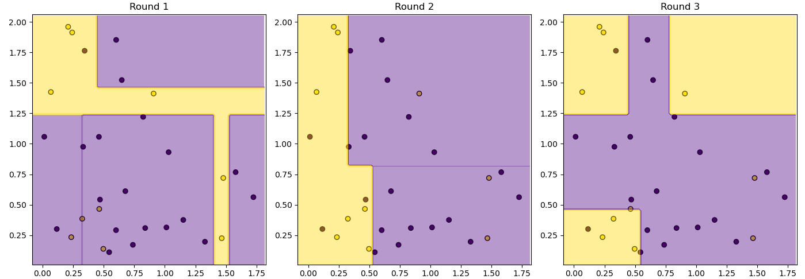

### Bagging

Bagging was implemented using scikit learn Decision Tree. Bagging was tested for the case of  Real Input Discrete Output. A random real input with 2 features and discrete output with 2 classes was generated. 

The maximum depth of tree was set to be 3. The number of rounds in Bagging was also set as 3. 

The decision surface for each round and the combined decision surface is shown.

    

    

