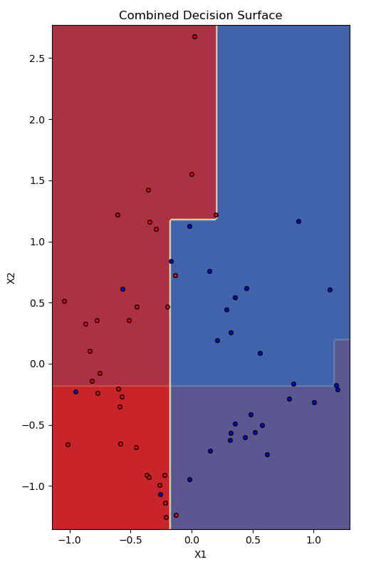

### Random Forest

The classification problem is solved in Q7-b using random forest. Random forest in such way that a user can select whether to use scikit learn decision tree or the Decision tree implemented in Q1. A random set of features are selected to train the decision trees. The max-depth of tree and number of trees in forest can be given by user. The classification dataset is shown below : 

    

A random seed of 43 was fixed and dataset was shuffled according to seed. The first 60% of the data for training and last 40% of the data set for testing. Since the classification data has only two features both the features were used in the trees of random forest. 

A Random forest with 6 trees each having max-depth of 3 was learned for classification data. 

The figure of learned trees is shown below.

    

The plot of decision surface for individual trees and combined decision surface is shown below : 

    

    

